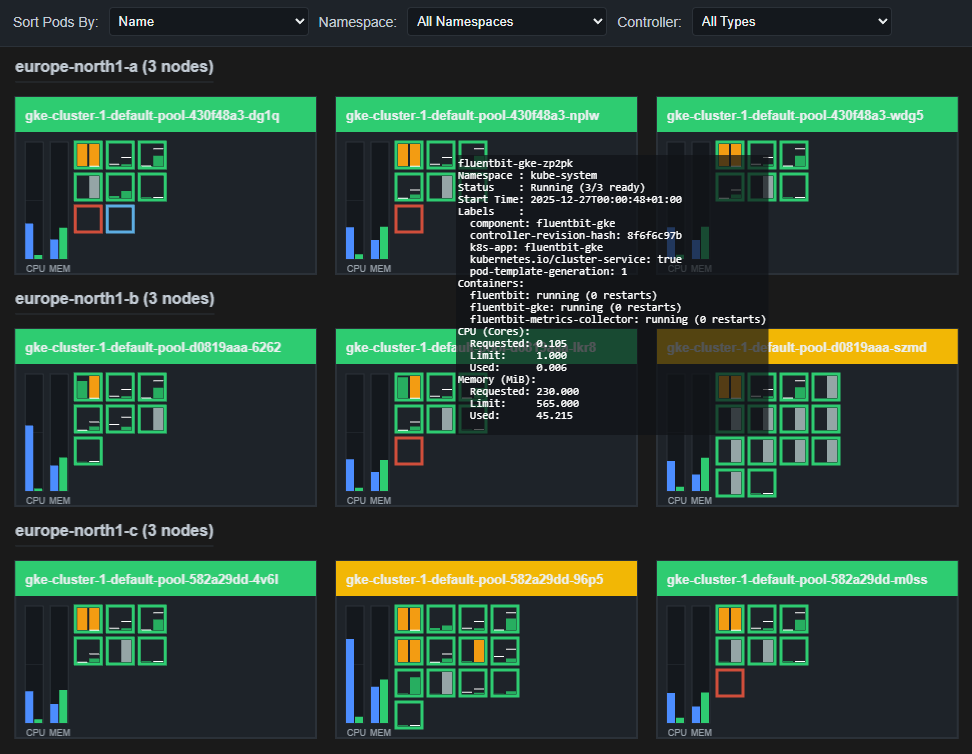

# kube-ops-view-ng
Lightweight Kubernetes cluster visualizer and dashboard. Heavily inspired by https://codeberg.org/hjacobs/kube-ops-view



#### Run & build with Docker
Prebuild container is available on Docker Hub: https://hub.docker.com/r/pettersolberg88/kube-ops-view-ng

```bash
# Build
docker build -t kube-ops-view-ng:local .

# Run
docker run --rm -p 8080:8080 -e PORT=8080 -v "/home/<yourhome>/.kube/config:/home/ubuntu/.kube/config" kube-ops-view-ng:local
# Then visit: http://localhost:8080
```

#### Deploy to Kubernetes
An example manifest is provided:

```bash
kubectl apply -f deploy/kube-ops-view-ng.yaml
```

#### Configuration
- `PORT` — port for the HTTP server (default: `8080`).
- Kubernetes config will be used in the following order:
- If running inside the cluster, it will use the service account token.
- `KUBECONFIG` environment variable.
- `.kube/config` in the user's home directory.

#### Useful endpoints
- `GET /` — serves the static UI built with Node.js, Vite, and PixiJS.
- `GET /api/alive` — liveness probe, always returns `200 OK`.
- `GET /api/ready` — readiness probe, returns `200 OK` if the last update from the cluster was within the last 30 seconds.
- `GET /api/snapshot` — current cluster snapshot.
- `GET /api/stream` — live updates via Server-Sent Events.

#### Notable features compared to kube-ops-view
- Group nodes by zone
- Filter by namespace
- Filter by pod controller type
- Multiple container-runtime architectures: `linux/amd64`, `linux/arm64`, `linux/arm/v7`, `linux/riscv64`, `linux/ppc64le`, `linux/s390x`
- (Hopefully) no memory leaks

## Credits
Henning Jacobs for the original idea and the inspiration. https://codeberg.org/hjacobs

Contributors:
* [pettersolberg88](https://github.com/pettersolberg88)
* [sklirg](https://github.com/sklirg)

## License
This program is free software: you can redistribute it and/or modify
it under the terms of the GNU General Public License as published by
the Free Software Foundation, either version 3 of the License, or
(at your option) any later version.

This program is distributed in the hope that it will be useful,
but WITHOUT ANY WARRANTY; without even the implied warranty of
MERCHANTABILITY or FITNESS FOR A PARTICULAR PURPOSE.  See the
GNU General Public License for more details.

You should have received a copy of the GNU General Public License 
along with this program.  If not, see <https://www.gnu.org/licenses/>.